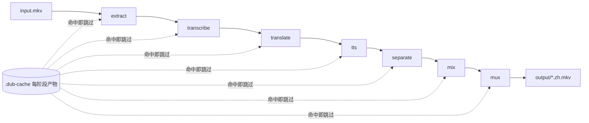

# Architecture — dub

> 六阶段串接，配置驱动，hash 缓存，断点续跑。对应 v0.1。

## 总览

`dub zh` 跑完整链路；各阶段产物落盘到 per-input 工作目录，命中即跳过。分层：`pipeline.py` 编排 → `stages/` 阶段逻辑 → `providers/` 厂商调用。

## 阶段

| # | 阶段 | 输入 | 输出 | 实现 |
|---|---|---|---|---|
| 1 | extract | 容器 | `audio.wav` 16k mono | ffmpeg |
| 2 | transcribe | audio | `Segment[]` 带时间戳 | DashScope Paraformer-v2（音频传 OSS） |
| 3 | translate | `Segment[]` | 填 `text_zh` | DeepSeek（OpenAI 兼容） |
| 4 | tts | `Segment[]`+音色 | `tts_clips/*.wav` | MiniMax T2A |
| 5 | separate | 原片（HQ） | `accompaniment.wav`（无人声） | 本地 Demucs `two_stems=vocals`；缺失降级 |
| 6 | mix | accompaniment+clips | `zh_audio.wav` | pydub，句间 ducking（`duck_db`） |
| 7 | mux | 原片+zh_audio | `*.zh.mkv` | ffmpeg 加轨 |

## 关键抽象

- **`Segment`**（`id, text_src, text_zh, start_ms, end_ms`）：贯穿全链路的最小单元，时间戳是唯一锚点。
- **`JobContext`**：单输入的可变状态。
- **`AppConfig`**：`default.yaml`（阶段参数）+ `voices.yaml`（音色）+ `.env`（密钥）。

## 缓存与续跑

目录键 = `input_hash(文件+voice) + sha1(全阶段配置)[:12]`。配置变 → 新目录，安全重跑。每阶段查产物存在 + `resume` 即跳过；`--no-resume` 强制全跑。

## provider 解耦

`stages/` 按 `cfg.provider` 派发到 `providers/`。换厂商 = 加一个 provider 文件 + 改配置。

## 关键决策

| 决策 | 选择 | 理由 |
|---|---|---|
| 全云 vs 本地模型 | 全云（ASR/翻译/TTS）+ 本地 Demucs 分离 | 国内云 API 可达；分离用本地 GPU（有 3090），无 GPU 时降级 |
| 缓存粒度 | 阶段级文件 | 简单；改配置自动失效 |
| 输出 | 附加 mkv 轨 | 不动原片，可回退可对比 |

## 已知风险

- **时长对齐：已自动修复（原头号）**：`dub.remediate` 三级阶梯——① 翻译期字数预算重译 → ② TTS speed 重合成 → ③ ffmpeg `atempo` 保音高精确对齐，保证 clip ≤ 段窗口；退化短窗截断。已接入 translate/pipeline。live 实跑验证待 `--run-live`。
- **翻译地道度未验证**：当前 deepseek-chat + 基础 prompt。→ E1
- **音色是占位值**：`nature` 已固化 `male-qn-yuanbo`，其余仍待试听验收。→ E3
- **核心已测、provider 未测**：cache/models/timing/remediate/mix/separate 等纯函数与编排器已有单测（快车道 74 绿 + 3 live 跳过）；provider 改字段仍会静默坏掉，契约测试待 E4。
- ~~**混音无分离**：整体 -12dB，中文段英文旁白仍漏出。~~ **已解（E7）**：Demucs 去人声 + 句间 ducking；无 GPU/未装时降级回整体衰减。
- **OSS 临时对象**：失败路径下是否回收未验证。

## 运行环境

Python ≥ 3.10；ffmpeg 在 PATH；国内网络。人声分离需 `pip install -e '.[sep]'`（Demucs），建议 NVIDIA GPU；无 GPU 自动降级。
